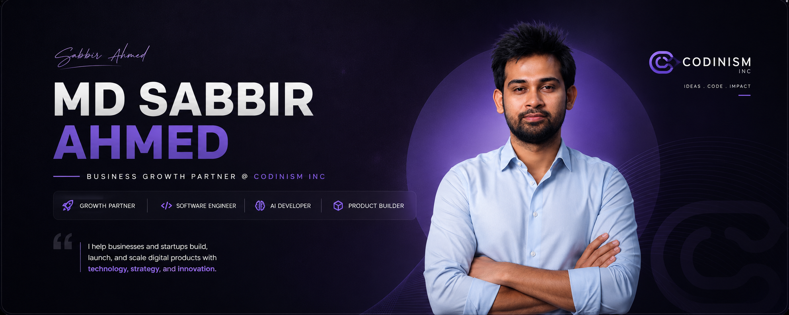

  

<h1 align="center">
Hi 👋 I'm Md Sabbir Ahmed
</h1>

Business Growth Partner @ Codinism Inc

Building AI-powered software, scalable digital products, and business growth systems.

---

# 🚀 About Me

I help startups and businesses transform ambitious ideas into modern digital products.

Currently working as a **Business Growth Partner at Codinism Inc**, I bridge the gap between business strategy and engineering by delivering AI-powered software, scalable web platforms, mobile applications, and intelligent automation solutions.

I enjoy solving complex business problems with technology while continuously exploring Artificial Intelligence, Machine Learning, SaaS architecture, and cloud technologies.

---

# 💼 What I Build

<table>
<tr>
<td width="50%">

### 🤖 AI

- AI Applications
- AI Agents
- LLM Integrations
- Machine Learning
- Intelligent Automation

</td>

<td width="50%">

### 💻 Software

- Full Stack Web Apps
- Enterprise Software
- SaaS Platforms
- REST APIs
- Cloud Applications

</td>
</tr>

<tr>
<td>

### 📱 Mobile

- Flutter
- React Native
- Firebase
- Cross Platform Apps

</td>

<td>

### 🌍 Web

- Shopify
- Webflow
- Next.js
- React.js

</td>
</tr>
</table>

---

# ⚡ Tech Stack

**AI**

OpenAI • LangChain • TensorFlow • PyTorch • RAG • AI Agents

**Platforms**

Shopify • Webflow • WordPress

---

# 🚀 Featured Projects

| Project | Description |
|---------|-------------|
| 🤖 AI Products | AI Agents, LLM Applications, Intelligent Automation |
| 👕 Aureevo | Premium fashion eCommerce platform |
| 🏢 Enterprise SaaS | Business management and workflow automation |
| 📱 Mobile Apps | Cross-platform Flutter applications |
| 🌐 Modern Web Apps | High-performance Next.js applications |

---

# 📊 GitHub Analytics

---

# 🌱 Currently Working On

- 🤖 AI Agents & Business Automation
- 🧠 Machine Learning Applications
- ☁️ Enterprise SaaS Products
- 📱 Cross Platform Mobile Apps
- 🌐 Modern Web Platforms
- 🚀 Startup MVP Development

---

# 🎯 2026 Goals

- Build world-class AI products
- Launch multiple SaaS platforms
- Contribute more to Open Source
- Help startups scale through technology
- Build products used by millions

---

# 🤝 Let's Connect

I'm always interested in collaborating on exciting projects related to:

- Artificial Intelligence
- Machine Learning
- Software Engineering
- SaaS Development
- Mobile Applications
- Shopify
- Webflow
- Enterprise Software
- Startup Products

---

## 💭 Philosophy

> **Technology creates value only when it solves real business problems.**

 

### ⭐ If you like my work, consider giving a star to my repositories.

